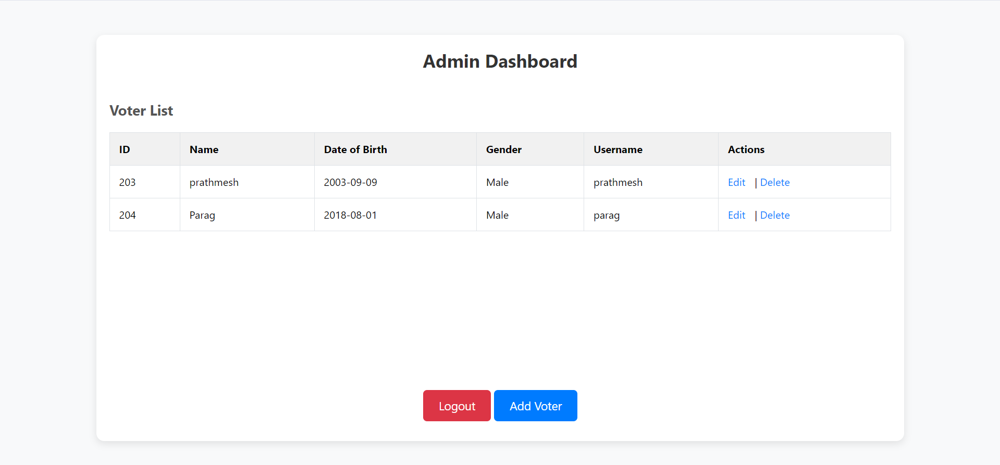
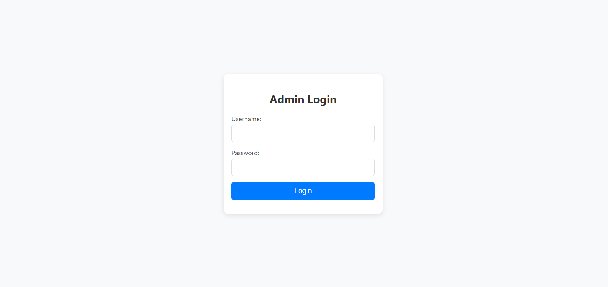
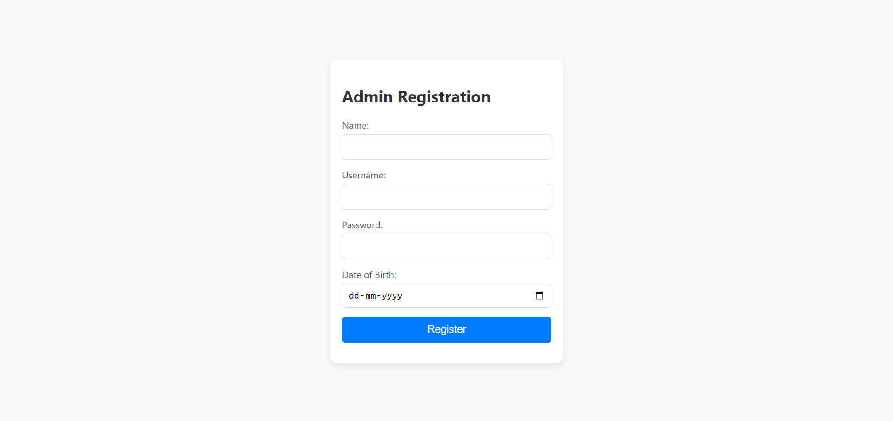
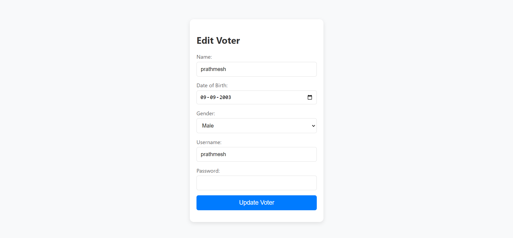
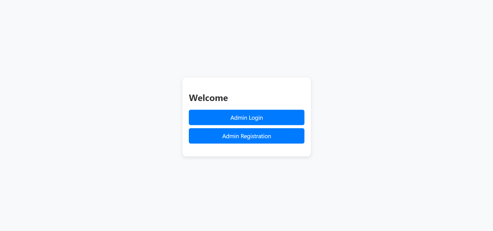
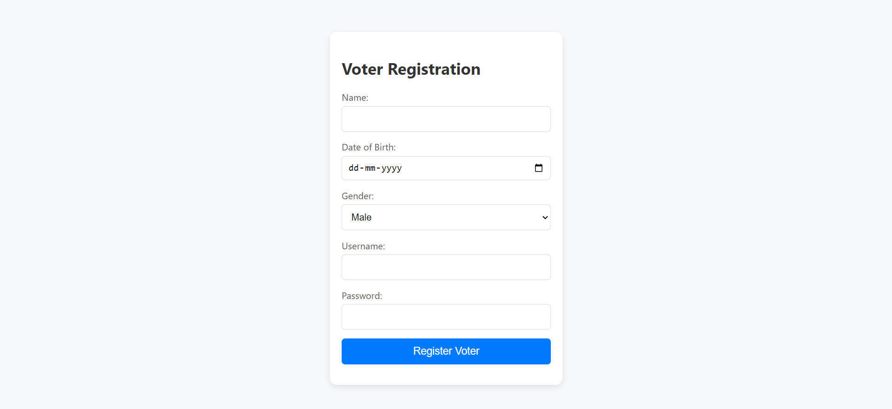

# Voting System Application

## Overview

The Voting System Application is a Spring Boot project designed to manage voter registrations and admin functionalities. It allows administrators to register new admins and manage their profiles, while voters can register themselves and participate in voting processes.

## Features

- **Admin Registration**: Admins can register themselves with their name, username, password, and date of birth.
- **Voter Registration**: Voters can register with their name, username, password, date of birth, and gender.
- **Admin Login**: Admins can log in to access administrative functionalities.
- **Voter Login**: Voters can log in to access their voting rights and view their registration details.

## Technologies Used

- **Spring Boot**: For creating stand-alone, production-grade Spring-based applications.
- **Thymeleaf**: For rendering HTML views.
- **Java**: The programming language used for backend development.
- **Maven**: For managing project dependencies and building the application.

